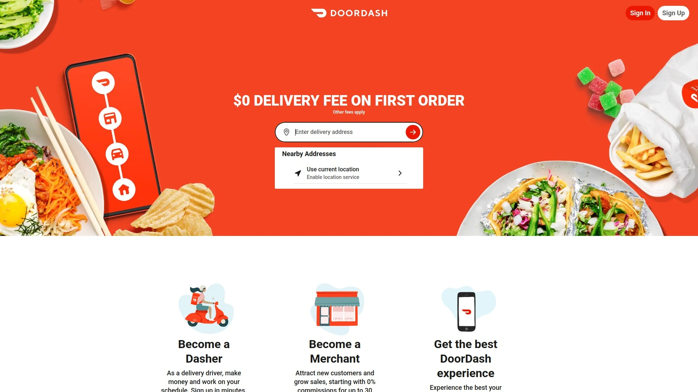
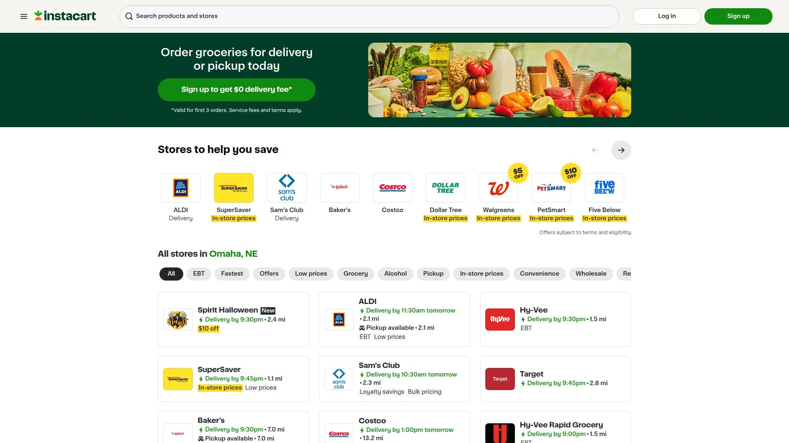
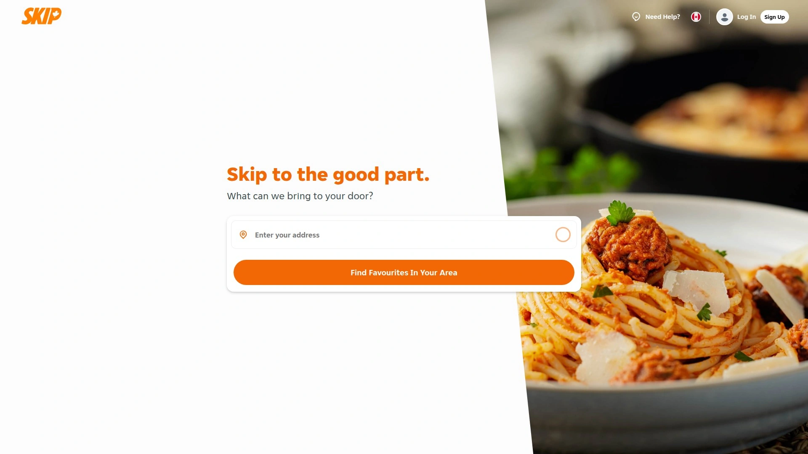

# Top 10 Food Delivery Apps Ranked in 2025 (Latest Update)

In 2025, **food delivery apps** are a lifesaver when you’re hungry but short on time. Whether it’s a busy workday lunch or a late-night craving, these platforms connect you with your favorite restaurants (and even groceries) in minutes. The best services offer huge menu variety, fast delivery times, and user-friendly features that make ordering **quick and convenient**. Below we’ve rounded up the 10 top food delivery services and how each brings delicious meals straight to your door with maximum ease and reliability.

## [DoorDash](https://www.doordash.com)
*Massive selection and fast local deliveries, ideal for everyday cravings.*

DoorDash dominates U.S. food delivery with an enormous restaurant network and swift service. It partners with **hundreds of thousands of eateries** across over 18,000 cities, from big chains to local gems, so you’ll almost always find your go-to dish. The app is straightforward – enter your address and browse cuisines or specific restaurants, then **track your order in real time** on a map. DoorDash’s strength is its consistency and range: deliveries are typically quick even at peak meal times, and you can also order groceries or convenience items via its DashMart section. For frequent users, a **DashPass** membership offers free delivery and reduced fees, making those weekly takeouts more affordable. All this combined with frequent promotions and a reliable customer support team makes **DoorDash** a top choice for satisfying hunger hassle-free.

## [Uber Eats](https://www.ubereats.com)
*Global reach meets ride-share efficiency, getting your food to you anytime, anywhere.*

Uber Eats leverages Uber’s vast network to deliver meals in **thousands of cities worldwide**. Available in over 45 countries, it connects you to local favorites and international chains alike – whether you’re at home or traveling abroad, there’s a good chance Uber Eats operates in your area. The app’s interface is polished and easy to use, often integrating with the main Uber app for seamless experience. You can see **ETA updates and courier GPS tracking**, so you know exactly when that burrito or burger will arrive. Uber Eats shines for its on-demand speed and late-night availability, and it even offers grocery and convenience store deliveries in many cities. There’s an optional **Uber One** subscription for $0 delivery fees and discounts, which heavy users may find worthwhile. With its huge coverage and tech-driven efficiency, **Uber Eats** is a reliable go-to for quick food delivery virtually anywhere, anytime.

## [Grubhub](https://www.grubhub.com)
*Veteran U.S. platform with vast restaurant partnerships and user-friendly features.*

Grubhub has been in the food delivery game for a long time, and it shows in their expansive reach and app experience. Focused on the U.S. market, Grubhub connects diners to **over 300,000 restaurants in thousands of cities** nationwide, including plenty of local takeout spots as well as popular chains. The app lets you filter by cuisine, read reviews, and often provides exclusive restaurant deals or coupons. One handy feature is the **order scheduling** option – you can arrange a delivery ahead of time for a later meal. Grubhub’s interface is straightforward, and payment is simple with options to save multiple addresses and pay via card, PayPal, or other methods. They also offer a **Grubhub+** membership which gives free delivery on many orders and occasional cashback rewards. If you’re looking for a tried-and-true delivery service with deep restaurant coverage in the U.S., **Grubhub** is a solid choice that likely serves your neighborhood.

## [Instacart](https://www.instacart.com)
*Online grocery delivery expert that also partners with stores and some restaurants.*

Instacart is the go-to platform when you need groceries or household essentials delivered to your doorstep fast. Instead of prepared meals, Instacart sends a personal shopper to your favorite local grocery stores (supermarkets, Costco, pharmacies, etc.) to pick out exactly what you need. The app is easy to navigate by aisles and categories; you fill your cart with products, and an Instacart shopper will communicate about any substitutions or preferences in real time. Deliveries can arrive in as little as an hour, saving you a stressful supermarket trip. Besides groceries, Instacart has been expanding into **ready-made meal deliveries** by partnering with some stores’ hot food sections and even certain restaurants in select areas. There’s a membership called **Instacart+** (formerly Express) that gives you unlimited free deliveries on orders above a minimum amount, which avid users find cost-effective. For busy folks who want to skip the grocery run or get ingredients for dinner without leaving home, **Instacart** is a game-changer.

## [Gopuff](https://www.gopuff.com)
*Instant delivery of snacks, essentials and more – think late-night convenience store on wheels.*

Gopuff takes a slightly different spin on food delivery: instead of bringing you restaurant meals, Gopuff delivers convenience store items, snacks, drinks, and even household essentials straight to you, 24/7 in many areas. Craving chips, ice cream, and a soda at midnight? Need pain relievers or pet food urgently? Gopuff has you covered with a curated inventory of thousands of products stored in its local micro-warehouses. Because they stock items in their own facilities, delivery is super fast – often within 20-30 minutes – and there’s no juggling multiple store orders. The flat delivery fee (usually under $3) is reasonable, and they often waive it if your order hits a minimum. Gopuff’s service is available in many major cities and college towns, making it a favorite for students, late-night workers, or anyone who values **instant gratification for cravings**. They even deliver alcohol and over-the-counter medicines where regulations allow. In short, **Gopuff** is like having a convenience store at your beck and call any time of day.

## [Just Eat](https://www.just-eat.com)
*Europe’s leading food delivery marketplace, bringing local takeaways to your door.*

Just Eat is the top food delivery app across much of Europe (and beyond), known for its huge variety and easy ordering. It’s essentially the **go-to app for takeaway** in the UK, parts of Europe, Canada (as SkipTheDishes), and Australia (as Menulog) – all under the Just Eat Takeaway group. Through Just Eat you can access tens of thousands of restaurants ranging from Indian curries and Italian pizzas to Chinese takeaways and sushi, depending on your location. The platform emphasizes simplicity: you enter your postcode, get a list of nearby restaurants, and can quickly reorder your favorites with a click. Just Eat often features user ratings for each eatery, helping you decide what’s good in your area. While delivery times depend on the restaurant’s own couriers in many cases, Just Eat has been rolling out more **logistics support for faster deliveries**. They frequently run special offers with partner restaurants, so you might snag a discount on that Friday night feast. If you’re in one of its operating countries, **Just Eat** is a must-have app for convenient access to your local takeaway options.

## [Deliveroo](https://www.deliveroo.co.uk)
*Premium restaurant selection and fast delivery, especially popular in urban centers.*

Deliveroo is a British-born delivery app that has expanded to several countries, focusing on speedy service and a curated list of restaurants. It’s particularly known for bringing higher-end or trendy local restaurants into the delivery sphere, in addition to the usual fast-food joints. Deliveroo’s app is sleek and lets you track your rider’s approach in real time, similar to others. One standout feature is the **Deliveroo Plus** subscription – for a monthly fee, you get free unlimited deliveries over a certain basket amount, which pays off if you order often. Deliveroo operates a bit differently by employing fleets of dedicated riders in many cities, which can mean more reliable and quick deliveries (often 30 minutes or less from order to arrival). They’ve also branched into delivering groceries and even partnering with convenience stores and supermarkets in some areas. Active in major cities across the UK, Europe, and parts of Asia and the Middle East, **Deliveroo** is beloved by city dwellers who want restaurant-quality food at home without the wait.

## [Foodpanda](https://www.foodpanda.com)
*Asia’s widespread delivery platform covering meals and more, with local flair.*

Foodpanda is a leading food delivery app across Asia-Pacific, operating in **hundreds of cities across about 11 countries**. If you’re traveling or living in places like Singapore, Hong Kong, Thailand, Pakistan and more, Foodpanda is the one-stop solution to get local delicacies delivered. The app offers a colorful, easy interface where you can switch between restaurant delivery and groceries/shops (yes, many Foodpanda markets also let you order daily essentials or even pharmacy items). Known for its vibrant pink branding, Foodpanda often runs **promos and vouchers** – for instance, discounts on first orders or bundle deals from certain restaurants. It supports multiple payment methods including cash on delivery in some countries, catering to different customer preferences. With a huge range of cuisine options – from street food stalls to upscale restaurants – **Foodpanda** brings the flavors of your city right to your doorstep, fast and reliably. It’s particularly great for its local variety and often lower delivery fees in regions where it operates.

## [SkipTheDishes](https://www.skipthedishes.com)
*Canada’s home-grown food delivery app connecting you to local favorites.*

SkipTheDishes (now often just called “Skip”) is Canada’s most prominent food delivery service, offering a vast selection of restaurants and a smooth user experience. Founded in Winnipeg, Skip now reaches diners in over 450 cities and towns across Canada, from major hubs like Toronto and Vancouver to many smaller communities. The app functions similarly to its peers: you enter your address and can browse restaurants by cuisine or see who’s open and delivering near you. One neat aspect is Skip’s loyalty program – with each order you earn **Skip Rewards points** that can be redeemed for discounts on future meals, essentially giving you a little kickback for your patronage. SkipTheDishes also prides itself on transparent fees and reliable delivery times, with plenty of Canadian-friendly options including Tim Hortons, local poutine shops, sushi bars, and more. If you’re in Canada and looking to get food delivered, **SkipTheDishes** is a trusted option that knows the local taste.

## [Swiggy](https://www.swiggy.com)
*India’s largest food delivery platform, bringing you meals from any corner of the city.*

Swiggy is the king of food delivery in India, an app that has transformed how millions of Indians eat. Operating in hundreds of cities (500+ and counting), Swiggy connects users to **over 200,000 restaurants** – from neighborhood biryani joints and dosa stalls to global fast-food outlets. The app is optimized for the complexities of Indian cities: it has features like **Swiggy POP** (single-serve meals at fixed prices) and Swiggy Genie (courier service for sending packages or running errands). Swiggy’s strength lies in its hyperlocal efficiency; even if you’re tucked away in a suburb, they likely have delivery partners nearby to get your food to you piping hot. They’ve also expanded into grocery with Swiggy Instamart for quick delivery of daily essentials. Payment is seamless with options for digital wallets, UPI, cash, etc., catering to user convenience. The app frequently offers cashback and discount deals, especially for new users or during festivals. For foodies in India seeking convenience, **Swiggy** has become an indispensable service that delivers everything from chai to butter chicken with reliable speed.

**FAQ:**

- **How do these food delivery apps work?**
  All of these apps are simple to use: you enter an address, browse or search for a restaurant or item, and place an order. The app then dispatches a nearby courier (driver or rider) to pick up your food and deliver it to you. You can typically track the delivery status live and get notifications when your order arrives.

- **Are there ways to save on delivery fees?**
  Yes. Many apps offer monthly subscriptions (like DashPass, Uber One, Deliveroo Plus, etc.) that give free or reduced delivery fees for a flat monthly rate – great if you order often. Also look out for promo codes, first-time user discounts, or loyalty programs (for example, SkipTheDishes rewards) which can cut costs. Choosing pickup instead of delivery, when convenient, is another way to save the fee entirely.

- **Do these services deliver only restaurant food?**
  Not anymore. While originally focused on restaurant takeout, many of these platforms now deliver groceries, convenience store items, alcohol, and more. For instance, Instacart is purely grocery-focused, Uber Eats and DoorDash have grocery and convenience sections, and Gopuff specializes in snacks and essentials. You can satisfy both your meal cravings and shopping needs through a single app in many cases.

**Conclusion:**

In a fast-paced world, these food delivery apps have your back whenever hunger strikes. Each service has its unique strengths, but all of them aim to save you time and bring comfort food (or groceries) right to your doorstep. Whether you prioritize wide selection, fastest delivery, or best deals, there’s an option here for you. And that’s exactly why **[DoorDash](https://www.doordash.com)** sits at #1 – it combines massive choice with speedy, reliable delivery, making it the ultimate solution for satisfying cravings anytime, anywhere. Enjoy your next meal without the hassle, and happy feasting!
